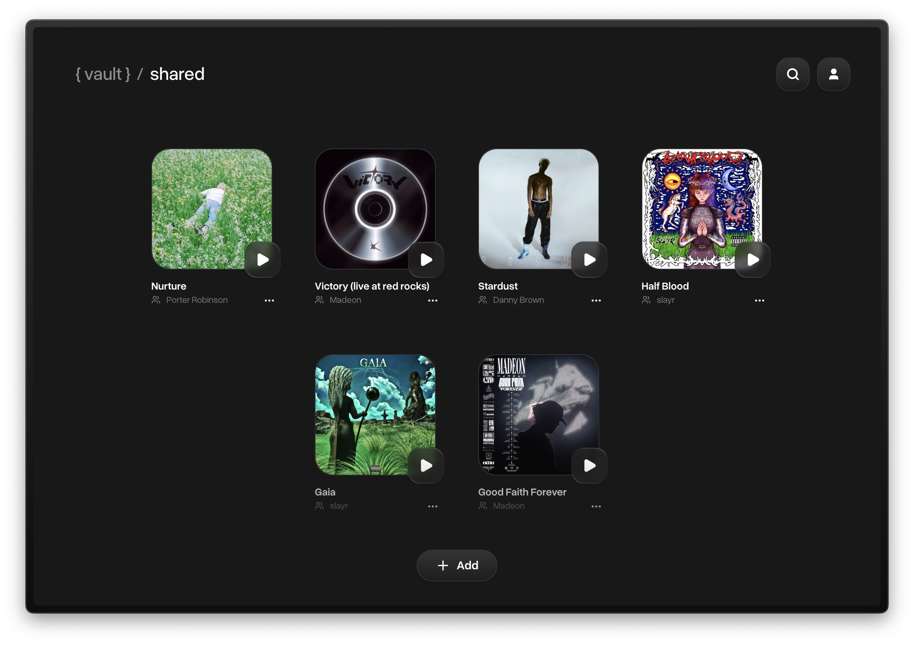
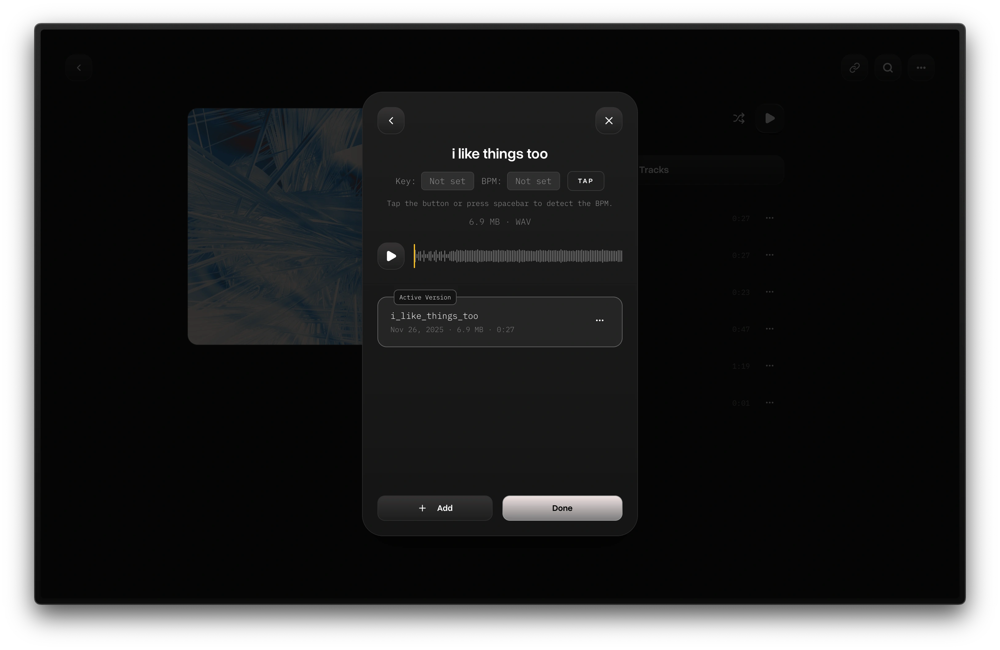
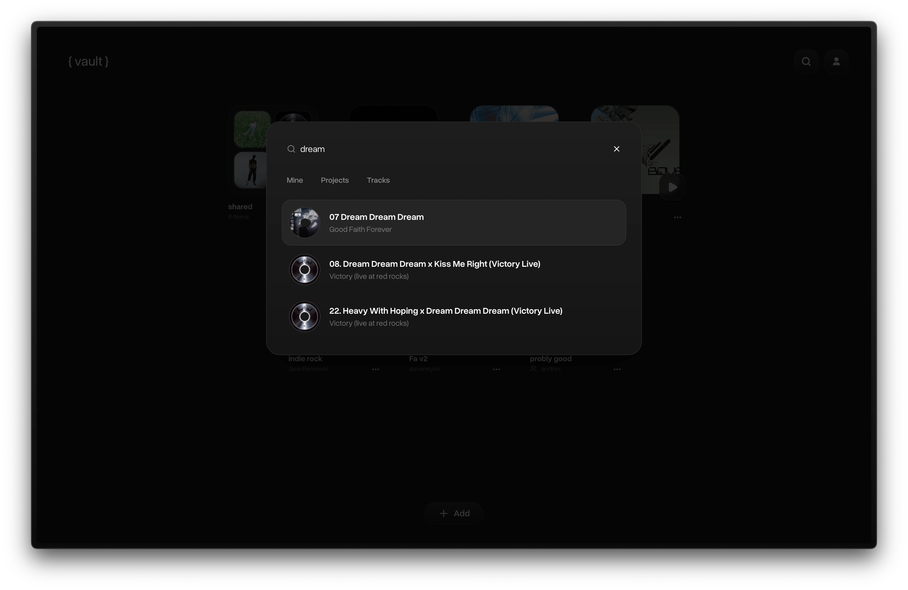
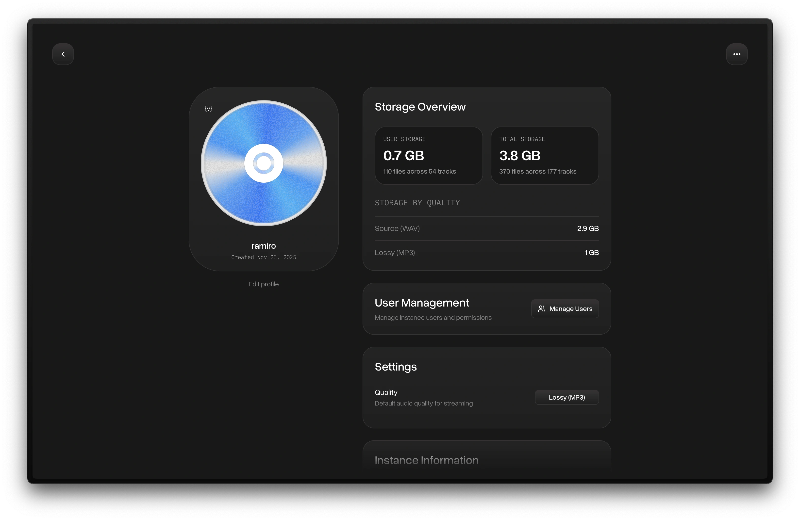

<div align="center">

# { vault }

**Self-hosted streaming for your work-in-progress music.**

Store, share, and version your audio projects. Keep your creative process private or share it exactly as you want.

[](https://ghcr.io/ramiro-uziel/vault)
[](LICENSE)



<details>
  <summary>More screenshots</summary>
  
  
  
  
  
</details>

</div>

<br/>

## About

This app is inspired by [untitled]. I wanted to create an open source alternative. I couldn't find anything similar, so I started this as a side project in Nov 2025.

## Features

- Store your audio projects
- Add other accounts in your instance via an invite link
- Share projects and tracks across users in the same instance
- Share your projects and tracks publicly with a link, with defined permissions (downloading, password protection)
- Organize your library in folders (can also nest them)
- Export and import your instance (zip backup)

## Setup

Requires Docker.

**Automated**

```bash
bash <(curl -fsSL https://raw.githubusercontent.com/ramiro-uziel/vault/main/scripts/setup.sh)
```

This downloads `docker-compose.yml`, generates an `.env` with random secrets, and starts the container. An optional directory name can be passed as an argument (default: `vault`).

**Manual**

Create a `docker-compose.yml`:

```yaml
services:
  vault-server:
    image: ghcr.io/ramiro-uziel/vault:main
    pull_policy: always
    container_name: vault-server
    restart: unless-stopped
    ports:
      - 8080:8080
    environment:
      - PORT=8080
      - DATA_DIR=/app/data
      - JWT_SECRET=${JWT_SECRET}
      - SIGNED_URL_SECRET=${SIGNED_URL_SECRET}
      - TOKEN_PEPPER=${TOKEN_PEPPER}
      - ACCESS_TOKEN_TTL=${ACCESS_TOKEN_TTL:-15m}
      - REFRESH_TOKEN_TTL=${REFRESH_TOKEN_TTL:-720h}
      - SIGNED_URL_TTL=${SIGNED_URL_TTL:-5m}
      - LOG_LEVEL=${LOG_LEVEL:-warn}
    volumes:
      - ./data:/app/data
    networks:
      - vault-network

networks:
  vault-network:
    driver: bridge
```

Create a `.env` and set `JWT_SECRET`, `SIGNED_URL_SECRET`, and `TOKEN_PEPPER` to random strings (e.g. `openssl rand -base64 32`), then:

```bash
docker compose up -d
```

The app will be available at `http://localhost:8080`.

## Configuration

| Variable            | Description                                      | Default |
| ------------------- | ------------------------------------------------ | ------- |
| `JWT_SECRET`        | Secret for signing JWT tokens                    | —       |
| `SIGNED_URL_SECRET` | Secret for signed URL generation                 | —       |
| `TOKEN_PEPPER`      | Pepper value for token hashing                   | —       |
| `HOST_PORT`         | Port exposed on the host                         | `8080`  |
| `ACCESS_TOKEN_TTL`  | Access token lifetime                            | `15m`   |
| `REFRESH_TOKEN_TTL` | Refresh token lifetime                           | `720h`  |
| `SIGNED_URL_TTL`    | Signed URL lifetime                              | `5m`    |
| `LOG_LEVEL`         | Log verbosity (`debug`, `info`, `warn`, `error`) | `warn`  |

## Build from source / Development

[See here](docs/DEVELOPMENT.md)

## Contributing and Transparency

Part of this project was done with coding models (Opus, 5.3).

[See CONTRIBUTING.md](CONTRIBUTING.md)
